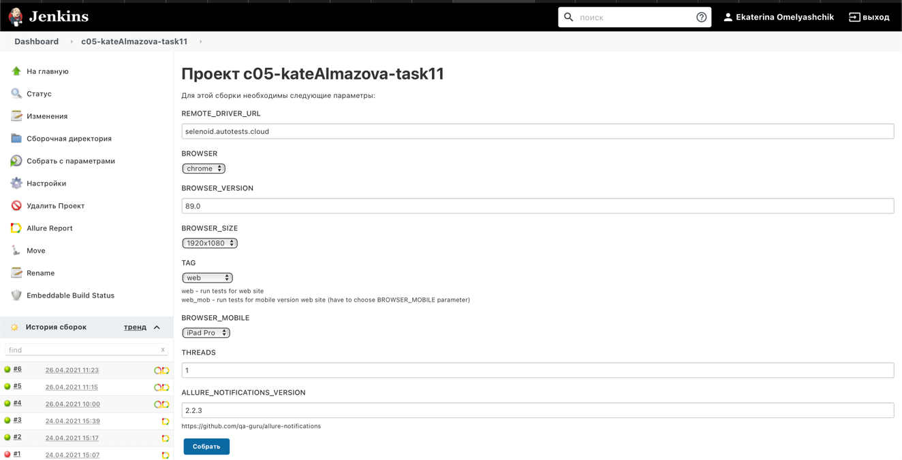
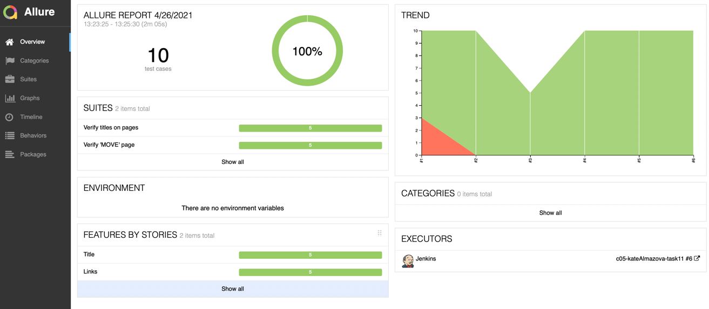
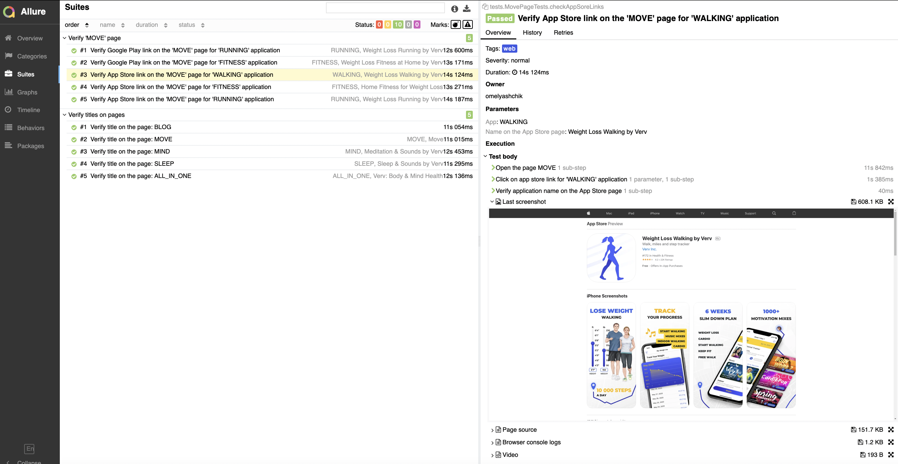
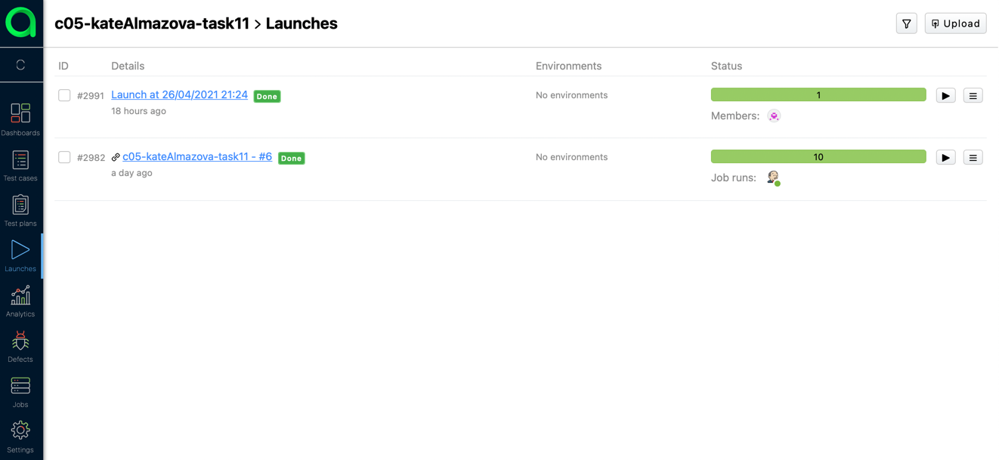
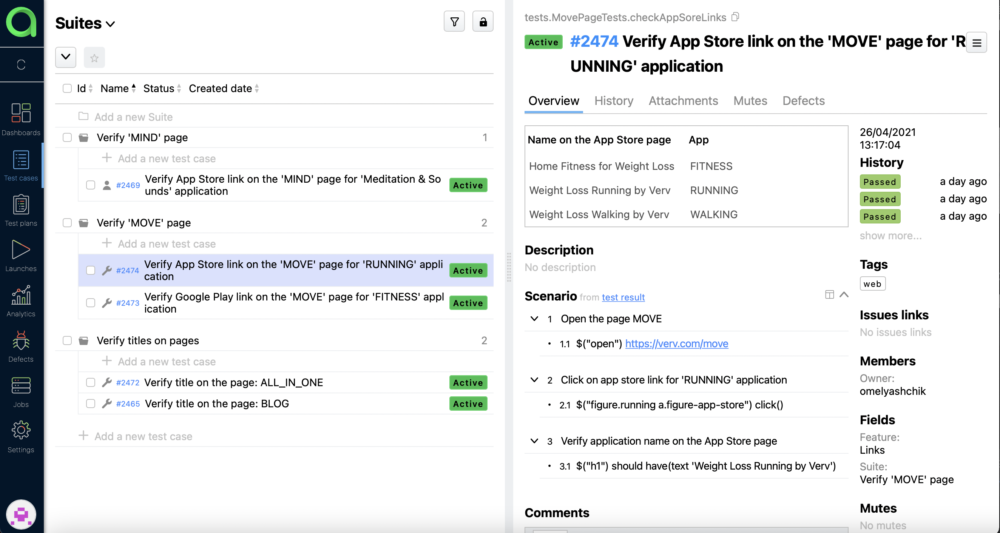
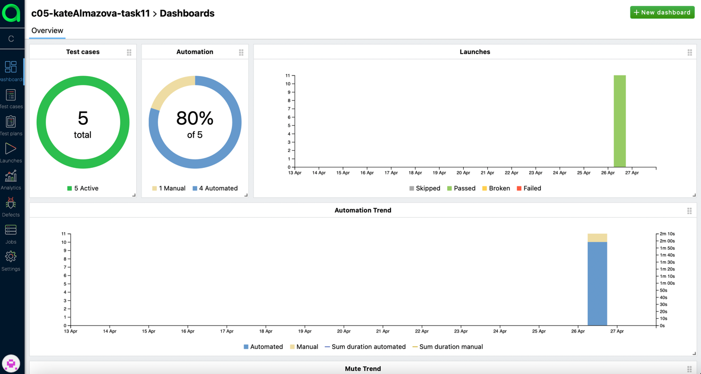
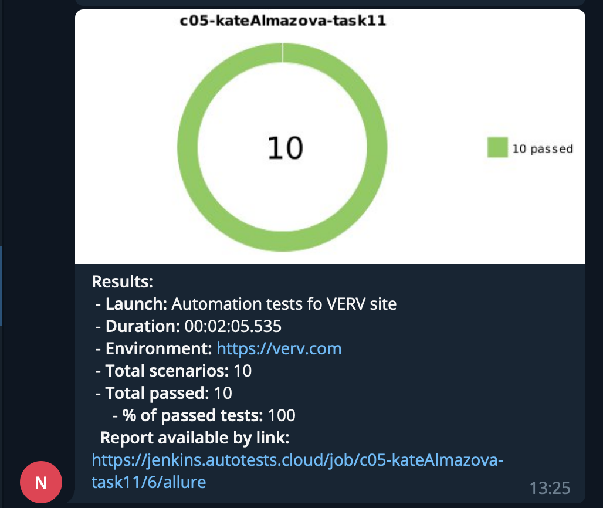

# UI tests for [VERV](https://verv.com/)
## Technology Stack

This project has written in [Java](https://go.java/) using [Selenide](https://selenide.org) framework. 
[Gradle](https://gradle.org) is used to build the project.
[JUnit 5](https://junit.org/junit5/) is used as a testing framework.
[Allure Report](http://allure.qatools.ru), [Allure TestOps](https://docs.qameta.io/allure-testops/) and 
[Telegram Bot](https://core.telegram.org/bots) are used to visualize test results.
Tests are launched from [Jenkins](). [Selenoid](https://aerokube.com/selenoid/) is used to run browsers in 
[Docker containers](https://www.docker.com/resources/what-container).

## Description
You can run tests by configuring the following parameters:

- Remote server
- Browser (Chrome, Firefox, Opera, Safari)
- Browser Version  
- Browser Size
- Standard or Mobile (iPhone X, Nexus 7, etc.) version website 
- Number of threads
  

## Allure reports
### Overview

### Test with steps, attached image, console logs and video

### Video

## Allure TestOps
### Launches

- **id #2991** - Manual launch
- **id #2982** - Automated launch

### Test Cases

### Dashboard

## Notification in Telegram

## Links
### Jenkins
https://jenkins.autotests.cloud/job/c05-kateAlmazova-task11/
### Allure reports
https://jenkins.autotests.cloud/job/c05-kateAlmazova-task11/allure/

